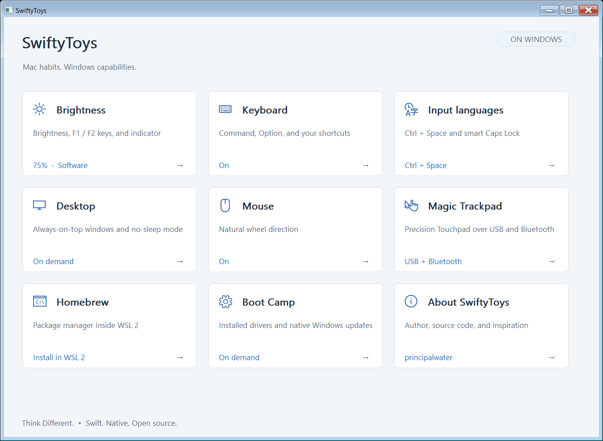

<h1 align="center">SwiftyToys</h1>
<p align="center">Mac habits. Windows capabilities.</p>
<p align="center">
  <a href="https://github.com/principalwater/SwiftyToys/actions/workflows/build.yml"></a>
  <a href="LICENSE"></a>
  <a href="https://github.com/principalwater/SwiftyToys/releases"></a>
</p>
<p align="center">
  <a href="https://github.com/principalwater/SwiftyToys/releases">Download</a> ·
  <a href="docs/Guide.md">Guide</a> · <a href="CHANGELOG.md">Release notes</a> ·
  <a href="CONTRIBUTING.md">Contribute</a>
</p>

Native **Swift 6.4** utilities for Windows, Boot Camp and former macOS users.
Inspired by and complementary to [Microsoft PowerToys](https://github.com/microsoft/PowerToys).
Independent of Microsoft and Apple. Local settings; no telemetry or web renderer.

**Think Different. On Windows.** By [principalwater](https://github.com/principalwater).



## Utilities

| | | |
| --- | --- | --- |
| **[Brightness](docs/Guide.md#features)** — software dimming or DDC/CI; keys, indicator, calibration and recovery | **[Keyboard](docs/Guide.md#features)** — editable Mac shortcuts, application rules and exclusions | **[Input languages](docs/Guide.md#features)** — Ctrl+Space, Caps Lock tap/hold and installed signed Apple RU/EN layouts |
| **[Desktop](docs/Guide.md#features)** — minimize, pin, lock, Sleep and temporary keep-awake | **[Mouse](docs/Guide.md#features)** — native vertical/horizontal wheel direction; no wheel interception | **[Magic Trackpad](docs/Trackpad.md)** — signed Precision drivers, USB/Bluetooth, gestures and recovery |
| **[Homebrew](docs/Guide.md#homebrew)** — WSL 2/Ubuntu setup and the official interactive Linux installer | **[Boot Camp](docs/Guide.md#features)** — installed driver metadata and native Windows update entry points | **[Languages](docs/Localization.md)** — English default, Russian example and extensible UTF-8 packs |

Open a tile to configure it. **Overview** or **Esc** returns to the tiles; drafts,
focus and scroll position survive navigation. Closing settings keeps SwiftyToys active.
Tray Quit restores the output and stops the tools.

## Install

**Windows 10 22H2 / Windows 11 x64** and
[Microsoft Visual C++ 2015–2022 x64 Redistributable](https://aka.ms/vs/17/release/vc_redist.x64.exe).
Download the complete `win-x64.zip` from [Releases](https://github.com/principalwater/SwiftyToys/releases),
extract it and run `install.ps1` with Windows PowerShell. Per-user installation needs no Swift compiler or Swift runtime DLLs.

WSL and driver setup request administrator consent separately and may require a restart.
Existing BrightnessCtl settings migrate after safe restoration; its installation remains for rollback. [Installation, CLI and compatibility details](docs/Guide.md).

## Brightness

**Hardware brightness (DDC/CI)** switch:

- **On:** brightness changes the monitor backlight, including the cursor. Requires
  compatible DDC/CI; writes are verified and recovery is retained.
- **Off:** software dims the image; the physical backlight stays unchanged.
  Leaving DDC restores its previous backlight once. Automatic/Windows/AMD methods
  may leave hardware cursors brighter. **Software with cursor (experimental)**
  includes the pointer and ordinary tooltips on one active physical SDR display;
  100% stops its viewport and restores the native cursor. It uses additional
  composition resources; protected surfaces and exclusive fullscreen need validation.

Holding F1/F2 repeats brightness using Windows keyboard timing. **Ctrl+Alt+Shift+F10**
requests 100% as an emergency reset.

Supports one independent **physical SDR output**. HDR, clones and virtual outputs
are excluded; fullscreen/calibration software can compete for the output.
[Supported hardware and remaining checks](docs/Requirements.md) · [Validation](docs/Validation.md).

## Mac shortcuts

Edit all shortcuts in Keyboard. **Cmd means the Windows key.**

| Shortcut | Action |
| --- | --- |
| Ctrl+Space | Switch input language |
| Cmd+Tab | Cycle windows while holding Cmd |
| Cmd+H | Minimize; bare Cmd opens Start |
| Cmd+Option+← / → | Browser tabs |
| Cmd+Ctrl+Q | Lock screen |
| Cmd+Ctrl+S | Sleep; preserve wake events and the power plan |
| Cmd+Ctrl+T | Pin/unpin the active window |

The preset includes editing, search, screenshot and Option word-navigation shortcuts.
It replaces the listed Windows meanings, including Win+arrow Snap and Win+Space;
edit/delete rules to restore them. Keep one remapper for the same shortcuts.
Normal-user injection cannot control elevated apps or the secure desktop.
[Input limitations, Apple layouts and trackpad models](docs/Guide.md#features).

## Build and contribute

Use the official Swift 6.4 Windows toolchain, MSVC and Windows SDK.
Portable BrightnessCore/KeyboardCore tests use Swift Testing; native interop is header-only.

```powershell
./scripts/build.ps1
./scripts/test.ps1
./scripts/package.ps1
```

[Contributor guide](CONTRIBUTING.md) · [Packaging](docs/Packaging.md) ·
[Windows interop](docs/WindowsInterop.md) · [Performance](docs/Performance.md) ·
[Security](SECURITY.md). CI verifies Windows and macOS core checks. External changes
use reviewed PRs; the maintainer controls merges. Size budgets are 6.6 MB EXE / 3 MB ZIP;
performance advantages require reproducible measurements.

## Credits and license

[BrightnessCtl 0.5.3](https://github.com/principalwater/BrightnessCtl) display control and
recovery code is integrated directly; its history and MIT copyright are retained.
PowerToys inspired the tool/settings model; Apple inspired the familiar habits.
[MIT](LICENSE) · [Third-party notices](THIRD_PARTY_NOTICES.md).
Proprietary Apple driver/layout binaries are not redistributed.
